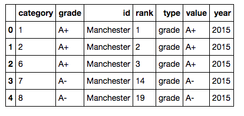
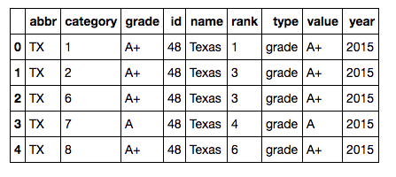

### How to access SBFS data via Python       


#### Steps     
1. Import relevant libraries (json, pandas, requests)     
2. Request the data from SBFS API using requests.get()     
3. Import the JSON data using .json()     
4. Convert data to a dataframe using user defined function provided      


```python 
import json
import pandas as pd
import requests 

url = "https://data.thumbtack.com/v1/friendliness/grades-ranks"
fs = requests.get(url)
fs.status_code # check that status code is OK (200)
fs.headers # check the Content-Type of this response; confirm that it's type json 
fs_data = fs.json() # import json data 

fs_data.keys() # check keys in dictionary

def rbind_fill (data, geo):
    geo_data = data[geo]
    geo_df = pd.DataFrame()
    
    for i in range(0, len(geo_data)): 
        df = pd.DataFrame(geo_data[geo_data.keys()[i]])        
        geo_df = pd.concat([geo_df, df])
    
    return geo_df
```

```python
cities_df = rbind_fill(fs_data, 'cities')
cities_df.head()
```
    


```python 
states_df = rbind_fill(fs_data, 'states')
states_df.head() 
```
    

