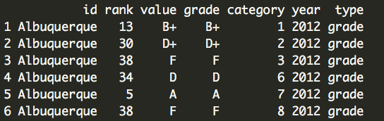

### How to access SBFS data via R
      
          
##### Steps:      
1. Request the data from ESS API using `GET()` from the httr library    
2. Check status of the response. If you're pulling data via multiple iterations then implement either  `warn_for_status(x)` or `stop_for_status(x)`    
3. If status is OK (200), then proceed to convert the data from response from JSON character string to an R object using `content()` as type `"text"`
4. Then convert JSON character string to an R object using `fromJSON()` function from the jsonlite library   
5. Convert elements in list to dataframes using `rbind.fill()` from the plyr library       
        
            
##### Data Source: Business Friendliness: Friendliness Data 
https://data.thumbtack.com/v1/friendliness/grades-ranks  

```r
library(plyr) # for rbind.fill()
library(httr)
library(jsonlite)

fs_response <- GET("https://data.thumbtack.com/v1/friendliness/grades-ranks")
warn_for_status(fs_response)
fs_text <- content(fs_response, "text")
fs_data <- fromJSON(fs_text, flatten = TRUE)$data

fs_data <- fromJSON(fs_text, flatten = TRUE) # type list 
names(fs_data)

fs_cities <- fs_data$cities
fs_states <- fs_data$states
fs_regions <- fs_data$regions 

cities_df <- rbind.fill(fs_cities)
states_df <- rbind.fill(fs_states)
regions_df <- rbind.fill(fs_regions)


head(cities_df)
```
       
        
              
                    
                        
